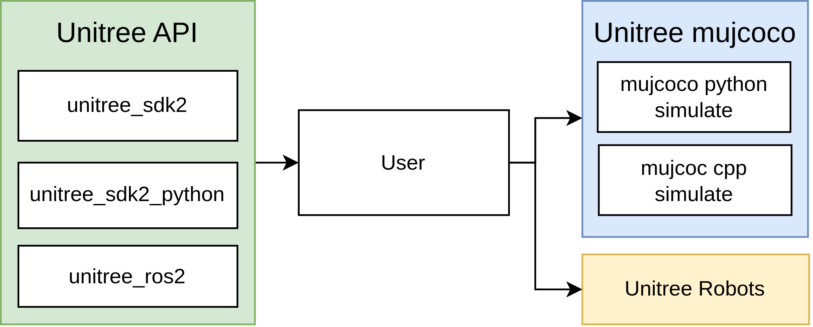
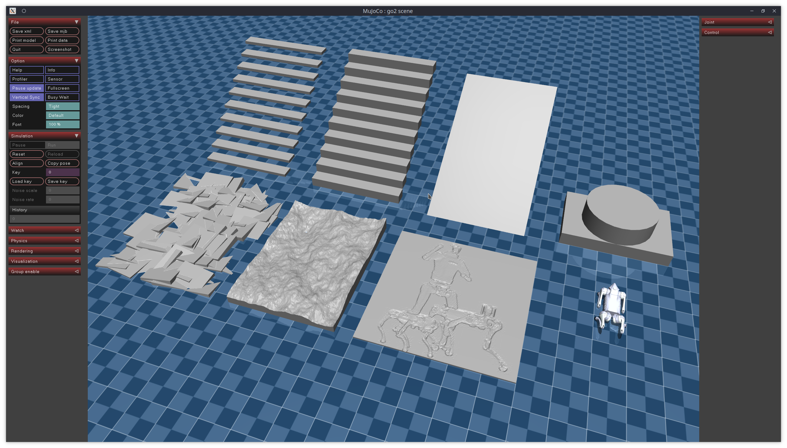

# Introduction
This repository extends the functionality of the existing `unitree_mujoco` simulator by integrating AI-trained policies for advanced robotic locomotion. It is a direct outcome of the research presented in the paper [Variable Stiffness for Robust Locomotion through Reinforcement Learning](https://arxiv.org/abs/2502.09436). Designed to complement the [TALocoMotion](https://github.com/gautica/TALocoMotion) repository, which facilitates policy training, this repository enables seamless execution of trained policies in both simulation and hardware environments.

### Features
- **Simulation**: Test and validate policies in a controlled virtual environment.
    
- **Hardware Execution**: Deploy policies directly on physical robots for real-world testing.

|  |  |  |
|:--------------------------------------:|:------------------------------------------:|:------------------------------------:|
| Forward Movement                       | Sidewards Movement                         | Rotate Movement                      |

This repository bridges the gap between simulation and physical deployment, providing tools and examples to streamline the transition from virtual testing to real-world application.


## Unitree mujoco
`unitree_mujoco` is a simulator developed based on `Unitree sdk2` and `mujoco`. Users can easily integrate the control programs developed with `Unitree_sdk2`, `unitree_ros2`, and `unitree_sdk2_python` into this simulator, enabling a seamless transition from simulation to physical development. The repository includes two versions of the simulator implemented in C++ and Python, with a structure as follows:


## Directory Structure
- `simulate`: Simulator implemented based on unitree_sdk2 and mujoco (C++)
- `simulate_python`: Simulator implemented based on unitree_sdk2_python and mujoco (Python)
- `unitree_robots`: MJCF description files for robots supported by unitree_sdk2
- `terrain_tool`: Tool for generating terrain in simulation scenarios
- `example`: Example programs

## Supported Unitree sdk2 Messages:
- `LowCmd`: Motor control commands
- `LowState`: Motor state information
- `SportModeState`: Robot position and velocity data

Note:
1. The numbering of the motors corresponds to the actual robot hardware. Specific details can be found in the [Unitree documentation](https://support.unitree.com/home/zh/developer).
2. In the actual robot hardware, the `SportModeState` message is not readable after the built-in motion control service is turned off. However, the simulator retains this message to allow users to utilize the position and velocity information for analyzing the developed control programs.

## Related links
- [unitree_sdk2](https://github.com/unitreerobotics/unitree_sdk2)
- [unitree_sdk2_python](https://github.com/unitreerobotics/unitree_sdk2_python)
- [unitree_ros2](https://github.com/unitreerobotics/unitree_ros2)
- [Unitree Doc](https://support.unitree.com/home/zh/developer)
- [Mujoco Doc](https://mujoco.readthedocs.io/en/stable/overview.html)

# Installation


## Prerequisites

### Install ROS 2 Humble / Foxy

Follow the official ROS 2 Humble or Foxy installation instructions for Ubuntu development:  
[ROS 2 Humble - Ubuntu Development Setup](https://docs.ros.org/en/humble/Installation/Alternatives/Ubuntu-Development-Setup.html)


### 2. Clone and Set Up Required Repositories

#### Unitree Mujoco
Clone and follow the setup instructions from:  
    [unitree_mujoco GitHub Repository](https://github.com/DarioRepoRuler/unitree_mujoco/tree/main?tab=readme-ov-file)

#### Unitree SDK2  
    [unitree_sdk2 GitHub Repository](https://github.com/unitreerobotics/unitree_sdk2)

#### Unitree ROS2  
    [unitree_ros2 GitHub Repository](https://github.com/unitreerobotics/unitree_ros2)

> **Important:**  
> In the `unitree_ros2` repository, ensure you checkout the correct branch (`humble` or `foxy`) for all repositories.  
> Mismatched branches can cause build errors, especially **after building CycloneDDS**.


## C++ Simulator (simulate)
### 1. Dependencies
#### unitree_sdk2
```bash
git clone https://github.com/unitreerobotics/unitree_sdk2.git
cd unitree_sdk2/
chmod +x ./install.sh
sudo ./install.sh
```
For more details, see: https://github.com/unitreerobotics/unitree_sdk2
#### mujoco >= 3.0.0
```bash
sudo apt install libglfw3-dev libxinerama-dev libxcursor-dev libxi-dev
```
```bash
git clone https://github.com/google-deepmind/mujoco.git
mkdir build && cd build
cmake ..
make -j4
sudo make install
```
Test:
```bash
simulate
```
If the mujoco simulator pops up, the installation is successful.
#### yaml-cpp
yaml-cpp is mainly used for reading configuration files:
```bash
sudo apt install libyaml-cpp-dev
```
### 2. Compile unitree_mujoco
```bash
cd unitree_mujoco/simulate
mkdir build && cd build
cmake ..
make -j4
```
### 3. Test:
Run:
```bash
./unitree_mujoco
```
You should see the mujoco simulator with the Go2 robot loaded.
In a new terminal, run:
```bash
./test
```
The program will output the robot's pose and position information in the simulator, and each motor of the robot will continuously output 1Nm of torque.


## Python Simulator (simulate_python)
### 1. Dependencies
#### unitree_sdk2_python
```bash
cd ~
sudo apt install python3-pip
git clone https://github.com/unitreerobotics/unitree_sdk2_python.git
cd unitree_sdk2_python
pip3 install -e .
```
If you encounter an error during installation:
```bash
Could not locate cyclonedds. Try to set CYCLONEDDS_HOME or CMAKE_PREFIX_PATH
```
Refer to: https://github.com/unitreerobotics/unitree_sdk2_python
#### mujoco-python
```bash
pip3 install mujoco
```

#### joystick
```bash
pip3 install pygame
```

### 2. Test
```bash
cd ./simulate_python
python3 ./unitree_mujoco.py
```
You should see the mujoco simulator with the Go2 robot loaded.
In a new terminal, run:
```bash
python3 ./test/test_unitree_sdk2.py
```
The program will output the robot's pose and position information in the simulator, and each motor of the robot will continuously output 1Nm of torque.

# Libtorch Setup (C++)
Libtorch is necessary if you want to execute trained policies with C++. This is typically necessary if you are not so powerful hardware.

When using the C++ scripts to execute the policies, make sure libtorch is porperly installed and setup.

- Download LibTorch from the official PyTorch site: [Pytorch Site](https://pytorch.org/get-started/locally/)

- Choose the correct version for C++ according to your NVIDIA driver (or CPU-only version if on laptop).

- Place the downloaded libtorch folder at: `/home/libtorch/`.

- If placed somwhere else change the path in CMakeLists.txt file at: `unitree_mujoco/examples/ros2/CMakeLists.txt`

- Set the LD_LIBRARY_PATH to include Libtorch:
    ```
    export LD_LIBRARY_PATH=$HOME/libtorch/lib:$LD_LIBRARY_PATH
    ```
- Then build the ROS2 workspace:
    ```
    cd /path/to/unitree_mujoco/examples/ros2
    colcon build
    ```

# Usage
## 1. Simulation Configuration
### C++ Simulator
The configuration file for the C++ simulator is located at `/simulate/config.yaml`:
```yaml
# Robot name loaded by the simulator
# "go2", "b2", "b2w", "h1"
robot: "go2"
# Robot simulation scene file
# For example, for go2, it refers to the scene.xml file in the /unitree_robots/go2/ folder
robot_scene: "scene.xml"
# DDS domain id, it is recommended to distinguish from the real robot (default is 0 on the real robot)
domain_id: 1

use_joystick: 1 # Simulate Unitree WirelessController using a gamepad
joystick_type: "xbox" # support "xbox" and "switch" gamepad layout
joystick_device: "/dev/input/js0" # Device path
joystick_bits: 16 # Some game controllers may only have 8-bit accuracy

# Network interface name, for simulation, it is recommended to use the local loopback "lo"
interface: "lo"
# Whether to output robot link, joint, sensor information, 1 for output
print_scene_information: 1
# Whether to use virtual tape, 1 to enable
# Mainly used to simulate the hanging process of H1 robot initialization
enable_elastic_band: 0 # For H1
```
### Python Simulator
The configuration file for the Python simulator is located at `/simulate_python/config.py`:
```python
# Robot name loaded by the simulator
# "go2", "b2", "b2w", "h1"
ROBOT = "go2"
# Robot simulation scene file
ROBOT_SCENE = "../unitree_robots/" + ROBOT + "/scene.xml"  # Robot scene
# DDS domain id, it is recommended to distinguish from the real robot (default is 0 on the real robot)
DOMAIN_ID = 1  # Domain id
# Network interface name, for simulation, it is recommended to use the local loopback "lo"
INTERFACE = "lo"  # Interface
# Whether to output robot link, joint, sensor information, True for output
PRINT_SCENE_INFORMATION = True
# Whether to use virtual tape, 1 to enable
# Mainly used to simulate the hanging process of H1 robot initialization
ENABLE_ELASTIC_BAND = False
# Simulation time step (unit: s)
# To ensure the reliability of the simulation, it needs to be greater than the time required for viewer.sync() to render once
SIMULATE_DT = 0.003  
# Visualization interface runtime step, 0.02 corresponds to 50fps/s
VIEWER_DT = 0.02
```
## 2. Terrain Generation Tool
We provide a tool to parametrically create simple terrains in the mujoco simulator, including stairs, rough ground, and height maps. The program is located in the `terrain_tool` folder. For specific usage instructions, refer to the README file in the `terrain_tool` folder.


## 3. Sim to Real
The `example` folder contains simple examples of using different interfaces to make the Go2 robot stand up and then lie down. These examples demonstrate how to implement the transition from simulation to reality using interfaces provided by Unitree. Here is an explanation of each folder name:
- `cpp`: Based on C++, using `unitree_sdk2` interface
- `python`: Based on Python, using  `unitree_sdk2_python` interface
- `ros2`: Based on ROS2, using `unitree_ros2` interface

### unitree_sdk2
1. Compile
```bash
cd example/cpp
mkdir build && cd build
cmake ..
make -j4
```
2. Run:
```bash
./stand_go2 # Control the robot in the simulation (make sure the Go2 simulation scene has been loaded)
./stand_go2 enp3s0 # Control the physical robot, where enp3s0 is the name of the network card connected to the robot
```
3. Sim to Real
```cpp
if (argc < 2)
{   
    // If no network card is input, use the simulated domain id and the local network card
    ChannelFactory::Instance()->Init(1, "lo");
}
else
{   
    // Otherwise, use the specified network card
    ChannelFactory::Instance()->Init(0, argv[1]);
}
```
### unitree_sdk2_python
1. Run
```bash
python3 ./stand_go2.py # Control the robot in the simulation (make sure the Go2 simulation scene has been loaded)
python3 ./stand_go2.py enp3s0 # Control the physical robot, where enp3s0 is the name of the network card connected to the robot
```
2. Sim to Real
```python
if len(sys.argv) < 2:
    // If no network card is input, use the simulated domain id and the local network card
    ChannelFactoryInitialize(1, "lo")
else:
    // Otherwise, use the specified network card
    ChannelFactoryInitialize(0, sys.argv[1])
```
### unitree_ros2

1. Compile
First, ensure that the unitree_ros2 environment has been properly configured, see [unitree_ros2](https://github.com/unitreerobotics/unitree_ros2).

```bash
source ~/unitree_ros2/setup.sh
cd example/ros2
colcon build
```

2. Run simulation
```bash
source ~/unitree_ros2/setup_local.sh # Use the local network card
export ROS_DOMAIN_ID=1 # Modify the domain id to match the simulation
./install/stand_go2/bin/stand_go2 # Run
```

3. Run real robot
```bash
source ~/unitree_ros2/setup.sh # Use the network card connected to the robot
export ROS_DOMAIN_ID=0 # Use the default domain id
./install/stand_go2/bin/stand_go2 # Run
```


---
# Policy Inference on robot

## Simulation
Once policies are trained and save via the code of our [Learning Repository](https://github.com/gautica/TALocoMotion) the trained policies can be tested via the python example script

```
cd example/python/ \
python policy_general.py
```

The current best performing model were placed in the folder `example/python/best_models`.
You can again swithc between the simulation and the real robot via changing the `ROS_DOMAIN_ID`.
The executed model can be changed with the yaml file loaded, just change the config filename in the python script. In the folder config multiple configs for different policies are stored there.

For C++ execution please be aware that these models first have to be converted into torchscript models, which are executable via libtorch in C++ code. This is can be done by loading and running the torchmodels by the `policy_general.py` script, but you have to make sure the `convert_to_torch_script` is set to true! The torchscript models are then placed in the folder `example/python/torchscript_model`. 

```bash
source ~/unitree_ros2/setup_local.sh # Use the local network card
export ROS_DOMAIN_ID=1 # Modify the domain id to match the simulation
./install/stand_go2/bin/policy_pos20 # Run
```


A few C++ scripts were prepared in order to circumvent building the code again for different models.
- `policy_general` is a standard script which is technically able to be used for both variable stiffness and position based policies.
- `policy_pos20` for executing Position based policy with 20 stiffness
- `policy_pos50` for executing Position based policy with 50 stiffness


## Hardware execution
For executing on the hardware use the `policy_general_hw.py` or the `./install/stand_go2/bin/policy_general_hw`.
Unless you have a powerful PC, execution of the policy and sending the commands to the robot are not in time using the python script. Therefore it is recommended to use the C++ script, which works fine on Laptops. It was tested with a Huawei Matebook and Ubuntu 22.04. 

```bash
source ~/unitree_ros2/setup.sh # Use the network card connected 
export ROS_DOMAIN_ID=0 # Use the default domain id
./install/stand_go2/bin/policy_general_hw # Run
```


### Controls

When controlling the robot you can use the key directions or the classical WASD controls.
- Forward: W/w
- Backward: S/s
- Left: a
- Right: d
- turn left: A (in C++ Z)
- turn right: D (in C++ C)
- Stand up (Space)
- Lay Down (D)
- Neutral Command (N)
- Emergency damping mode (E)


For Hardware execution the Remote is supported. The controls are as follows:

- left joystick: Forward, Backwards and Side Movement
- right joystick: Rotation
- A for standing up
- B for laying down


---

## CycloneDDS Build Error Fix

If you encounter the following error during build:

Could not locate cyclonedds. Try to set CYCLONEDDS_HOME or CMAKE_PREFIX_PATH


Run the following commands to build and install CycloneDDS manually:

```bash
cd ~
git clone https://github.com/eclipse-cyclonedds/cyclonedds -b releases/0.9.x
cd cyclonedds && mkdir build install && cd build
cmake .. -DCMAKE_INSTALL_PREFIX=../install
cmake --build . --target install
```


# Citation

If you used this work or found it helpful please cite us:
```
@misc{spoljaric2025variablestiffnessrobustlocomotion,
      title={Variable Stiffness for Robust Locomotion through Reinforcement Learning}, 
      author={Dario Spoljaric and Yashuai Yan and Dongheui Lee},
      year={2025},
      eprint={2502.09436},
      archivePrefix={arXiv},
      primaryClass={cs.RO},
      url={https://arxiv.org/abs/2502.09436}, 
}
```